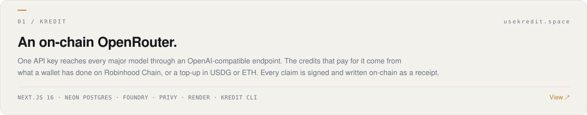
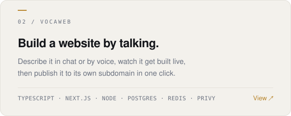
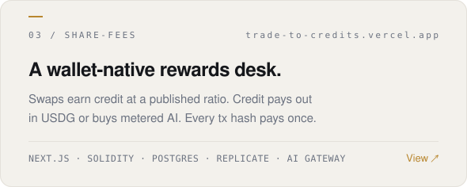

<picture>
  <source media="(prefers-color-scheme: dark)" srcset="assets/header-dark.svg">
  
</picture>

 

I build products where money, wallets and AI meet: full-stack apps on Next.js and Node, with the chain side in Solidity and Solana, and the payment side done carefully.

  <a href="mailto:saurabh.sharma9827@gmail.com">saurabh.sharma9827@gmail.com</a>
  &nbsp;·&nbsp;
  <a href="https://usekredit.space">usekredit.space</a>
  &nbsp;·&nbsp;
  <a href="https://trade-to-credits.vercel.app">trade-to-credits.vercel.app</a>

 

## Selected work

<a href="https://github.com/saurabh-sol/credit-is-what-you-need">
  <picture>
    <source media="(prefers-color-scheme: dark)" srcset="assets/kredit-dark.svg">
    
  </picture>
</a>

<table border="0" cellpadding="0" cellspacing="0" width="100%">
  <tr>
    <td width="50%" valign="top" style="padding:0">
      <a href="https://github.com/saurabh-sol/VocaWeb">
        <picture>
          <source media="(prefers-color-scheme: dark)" srcset="assets/vocaweb-dark.svg">
          
        </picture>
      </a>
    </td>
    <td width="50%" valign="top" style="padding:0">
      <a href="https://github.com/saurabh-sol/Share-fees">
        <picture>
          <source media="(prefers-color-scheme: dark)" srcset="assets/sharefees-dark.svg">
          
        </picture>
      </a>
    </td>
  </tr>
</table>

 

**Kredit** · [repo](https://github.com/saurabh-sol/credit-is-what-you-need) · [usekredit.space](https://usekredit.space)
One API key reaches every major AI model through an OpenAI-compatible endpoint. The credits that pay for it come from what a wallet has done on Robinhood Chain, or from a top-up in USDG or ETH. Claims are signed by the server and written on-chain as receipts anyone can verify. Ships with a dashboard, a playground, and a `kredit` CLI.
Next.js 16 · Neon Postgres · Foundry · Privy · Render

**VocaWeb** · [repo](https://github.com/saurabh-sol/VocaWeb)
Build a website by talking or typing. Describe the site in chat or by voice, watch it get built live, publish it to its own subdomain in one click. A pnpm monorepo with a dashboard app, an API, and shared packages for AI, voice and the database, with a deploy pipeline that puts each published site on Vercel.
TypeScript · Next.js · Node · PostgreSQL · Redis · Privy

**Share-fees** · [repo](https://github.com/saurabh-sol/Share-fees) · [trade-to-credits.vercel.app](https://trade-to-credits.vercel.app)
A wallet-native rewards desk. Qualifying token swaps earn credit at a published ratio, 50 bps of notional above a $250 floor. That credit converts either to USDG paid to the same wallet or to a metered key for AI chat and image generation. Every transaction hash pays once, no matter how many times it is scanned or claimed. Ethereum and Solana wallets both sign in.
TypeScript · Next.js · Solidity · Postgres · Replicate · Vercel AI Gateway

 

## Stack

| | |
|:--|:--|
| **Web** | TypeScript, Next.js, React, Tailwind, Node, pnpm monorepos |
| **Chain** | Solidity with Foundry, Solana (SPL tokens, wallet adapters, Rust), wagmi and viem, SIWE / SIWS sign-in, Privy |
| **Backend** | Python, PostgreSQL (Neon), Redis, Docker, Render and Vercel |
| **AI** | OpenAI-compatible APIs, Vercel AI Gateway, Replicate, retrieval over local documents |

 

## Also on this profile

- [Idempotent payment system with the Saga pattern](https://github.com/saurabh-sol/Idempotent-Payment-Order-System-Saga-Pattern-) · exactly-once orders with idempotency keys backed by Redis and a Postgres unique constraint, and compensating steps that roll back partial failures. Python, Stripe test mode.
- [Chaotic maps image encryption](https://github.com/saurabh-sol/Chaotic_maps) · XOR encryption of grayscale images with chaotic number matrices, in Python.
- Solana experiments · [mainnet transactions](https://github.com/saurabh-sol/Solana-Transaction), [SPL tokens with Token-2022](https://github.com/saurabh-sol/SPl-tokenProgram-with-token-22), a [pump.fun clone](https://github.com/saurabh-sol/PumpClone).

 

Building something with wallets, payments or AI? <a href="mailto:saurabh.sharma9827@gmail.com">Write to me.</a>
